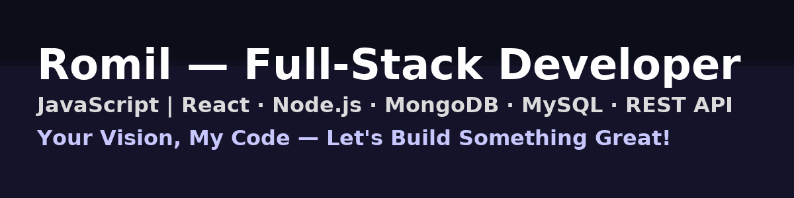

<!-- ---------------------------------------------------------
      GitHub Profile README – Romil
      Author: Romil Patel
----------------------------------------------------------- -->

<!-- Custom Banner -->

---

## 🧑‍💻 **About Me**

- 🔥 Full-Stack Developer — **React**, **Node.js**, **JavaScript**, **MongoDB**, **MySQL**
- 🚀 _Your Vision, My Code — Let’s Build Something Great!_
- 🎨 Passionate about UI/UX, clean architecture, performance & scalable systems
- ☁️ Exploring AWS, deployment pipelines & backend infrastructure

---

## 🚀 **Tech Stack**

### **Frontend**

### **Backend & Database**

### **Tools & Cloud**

---

## 🌐 **Portfolio**

🔗 **https://codevs.onrender.com/**

---

## 📌 **Recent Projects**

### 🔹 **Micro Jobs Portal**

A full-stack job marketplace (React + Node + MongoDB)

- 🔐 JWT Auth
- ⚡ Real-time actions
- 📡 REST APIs

### 🔹 **E-Commerce Store UI**

- 🛒 React UI
- 🧮 Product filters
- 📱 Responsive layout

### 🔹 **Portfolio v2 (Animated)**

- 🎞️ React + Framer Motion
- ⚡ Smooth animations
- 🎨 Clean, modern design

---

## 🎉 **Badges**

  
  
  

---

## 📬 **Connect With Me**

- 🌐 Portfolio → **https://codevs.onrender.com/**
- 💼 LinkedIn → **https://www.linkedin.com/in/patelromil2001/**
- ✉️ Email → patelromil.2001@gmail.com

---

  
### ⚡ *I turn coffee into clean, scalable code.*  
☕ ➡️ 💻

---
